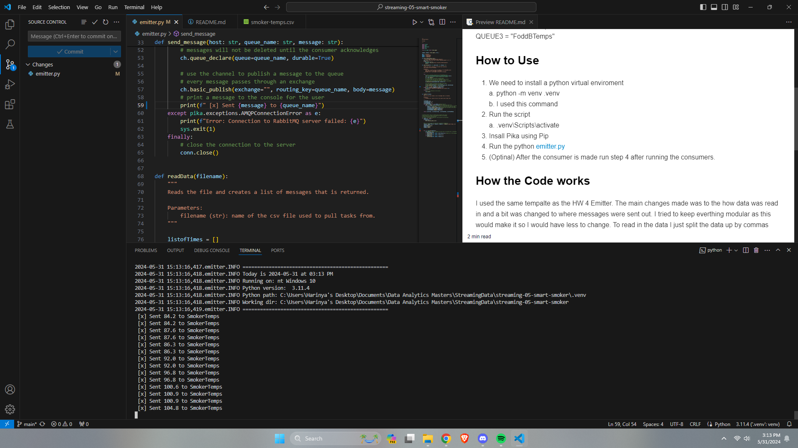

# streaming-05-smart-smoker

## Description 
This repo is for the use of sending data from smoker-temps.csv to a consumer that will take this data and use it in order to detect changes in tempatures in order to stimulate a "smart smoker". This repo only contains the producer and the data. 

Added for HW6
The consumer has been added as well as Email alerts. 

This repo will also be able to send alerts to a email of your chosing as the tempatures of the 3 queues hit different thresholds. 

## Important Variables 
I will list below important vaiables as using this code without these vairables set correctly on the consumerside will fail. 

QUEUE1 = "SmokerTemps"
QUEUE2 = "FoodATemps"
QUEUE3 = "FoddBTemps"

## How to Use 
1. We need to install a python virtual enviroment 
    a. python -m venv .venv
    b. I used this command 
2. Run the script 
    a. .venv\Scripts\activate
3. Insall Pika using Pip
4. Go into the Coonsumer.py and add you email and password and adjust the smtp setting depending on which email server you are using 
Note: Look up the smtp server and port for your email provider 
5. Run a terminal tab with the consumer 
6. Run a terminal tab with the Producer 
7. Done 

## How the Code works
I used the same tempalte as the HW 4 Emitter. The main changes made was to the how data was read in and a bit was changed to where messages were sent out. I tried to keep everthing modular as this would make it so I would have less to change. To read in the data I just split the data up by commas and append each data point to their resctive list. I then looped through the list to send the data and check if there is anyhting to send then send it. 

## Image of the code running (HW5)

## Image of the code running (HW6)

## Image of Smoker Alert

## Image of Food A Alert

## Image of Food B Alert

## Image of Email Alert Working 

